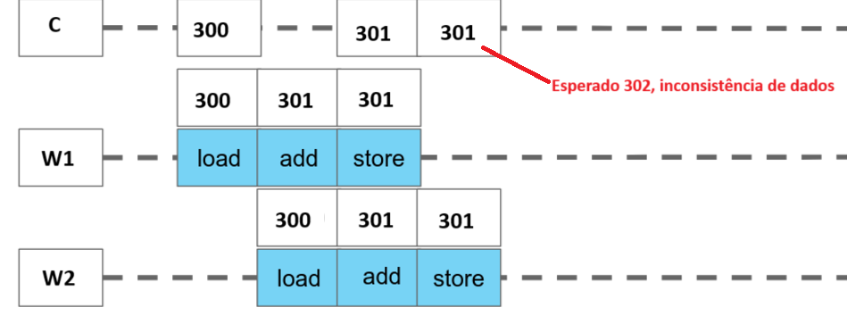

# Shared Counter

## Questão 6

- Analise o código de SharedCounter.java. Identifique qual deve ser a saída correta após as operações realizadas.

- Compile o programa SharedCounter.java.

- Execute a classe principal mais de uma vez, até obter um resultado diferente do esperado (errado!).

- Corrija o problema, identificando a classe do objeto compartilhado e o código que deve ser executado em exclusão mútua.

- Execute o programa novamente, mais de uma vez, para verificar se a correção funcionou.

## Código

~~~java
class Counter {
    private int count = 0;
    public void increment() {
      this.count++;
    }
    public int getCount() {
      return this.count;
    }
}
  
  
class Worker extends Thread {
  
    private Counter c;
    private int repetitions;
  
    public Worker(Counter c, int repetitions) {
      this.c = c;
      this.repetitions = repetitions;
    }
    
    @Override
    public void run() {
      for (int i = 0; i < repetitions; i++) {
        // do some work    
        Levenshtein.calculate("paradigmas","paradinhas");
        // increment counter
        c.increment();
      }
    }
  }
  
class SharedCounter {
  
    public static void main(String[] args) {
    
      Counter c = new Counter();
      
      Thread thread1 = new Worker(c, 1000);
      Thread thread2 = new Worker(c, 1000);
  
      thread1.start();
      thread2.start();
  
      try {
        thread1.join();
        thread2.join();
      } catch (InterruptedException e) {
        e.printStackTrace();
      }
  
      System.out.println("Final count: " + c.getCount());
    }
}

~~~

## Saída esperada:

O programa usa threads para calcular usando programação concorrente a Distância de Levenshtein entre duas strings. A Distância de Levenshtein é basicamente o número mínimo de inserções, exclusões e atualizações necessárias para transformar uma String em outra. Um contador **compartilhado** entre as threads é incrementado ao fim de cada iteração.
Como temos duas threads que realizam 1000 iterações cada, é esperado que a saída da execução seja:

~~~java
    $ javac *.java && java SharedCounter
    Final count: 2000
~~~

## Execução antes da correção:

Utilizando o script fornecido no exercício anterior obtemos:

~~~Java
$ javac *.java && bash repete-execucao.sh 100 java SharedCounter
===> 18a. execução:
Final count: 2000
===> 17a. execução:
Final count: 1999
~~~

## Problema encontrado:

A diferença que ocorreu se deve ao fato de que ambas as threads estão compartilhando um mesmo recurso, o Counter. O objeto Counter usado para instanciar ambos os Workers é o mesmo, então ao atualizar é possível que uma thread tente incrementar o arquivo antes da outra salvar, gerando uma incosistência nos dados.



## Correção

Para resolver tal problema é possível adicionar a palavra-chace ```synchronized``` na operação de incremento, garantindo que o incremento nunca seja executado em sequência.

~~~java
    class Counter {
        private int count = 0;
        public synchronized void increment() {
        this.count++;
        }
        public int getCount() {
        return this.count;
        }
    }
~~~

## Saída final:

~~~java
$ javac *.java && bash repete-execucao.sh 100 java SharedCounter
Resultados idênticos em todas as 100 execuções.
~~~

## Referências:

- Material das aulas
- [Algoritmo de Levenshtein](http://desenvolvendosoftware.com.br/algoritmos/strings/algoritmo-de-levenshtein.html)